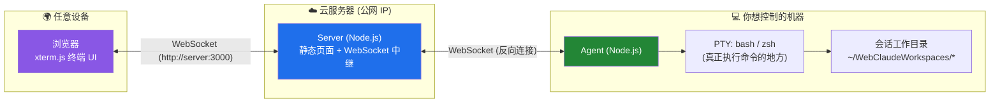
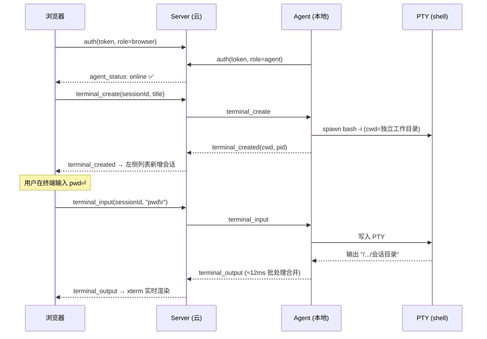
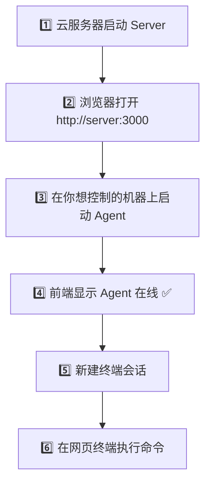

# Web-Claude — 通过网页远程控制本地终端

Web-Claude 让你在任意设备（手机、平板、笔记本）的浏览器里，**实时操作另一台机器的终端**：创建多个独立会话、在网页终端里执行任意命令（`ls`、`vim`、`git`、`npm`、`claude` …）、并在多个会话间切换。无需安装任何 App，打开浏览器即可。

整体交互类似 ChatGPT：**左侧是会话列表，右侧是当前会话对应的终端**，每个会话都是一个独立的后台 shell（基于 PTY），并绑定自己独立的工作目录。

---

## ✨ 核心功能

- 🖥️ **网页交互式终端**：基于 [xterm.js](https://xtermjs.org/) + [node-pty](https://github.com/microsoft/node-pty)，提供真正的交互式 shell（颜色、`vim`/`top`、Tab 补全、Ctrl-C、上下方向键历史等）。
- 🗂️ **多会话管理**：创建 / 切换 / 删除多个会话，互不干扰；任意来回切换，切回后终端仍可继续输入。
- 📁 **会话绑定独立工作目录**：每个会话自动获得一个独立工作目录，命令默认在其中执行；删除会话时可选择保留或一并删除目录。
- 🔁 **实时输出 + 断线重放**：输出实时回显；切换会话 / 刷新页面 / 重新连接后自动回放历史（不丢、不重复）。
- 🔒 **Token 鉴权**：浏览器与 Agent 共用一个密钥连接，支持环境变量 / 本地配置文件读取，不入仓库。
- 💬 **兼容 Claude Code**：在终端里直接输入 `claude` 即可进入交互式 Claude Code。

---

## ⚠️ 重要提醒：Server 和 Agent 不要混淆

> **Server 应部署在云服务器上。**
> **Agent 应运行在你想控制的那台机器上。**
>
> 如果你想通过网页控制自己的本地电脑，就**只在本地电脑启动 Agent**，**不要在云服务器上同时启动 Agent**。
>
> **Agent 运行在哪台机器，网页终端就控制哪台机器。** 在云服务器上误启动 Agent，会导致你以为在操作本地电脑，实际却在操作云服务器。
>
> **同一时间只允许一个有效 Agent 连接同一个 Server。** 同时启动多个 Agent 会互相抢占连接，导致会话错乱、输入丢失、终端控制对象错误。

这是本项目最容易踩的坑，请务必先理解下面的架构再启动。

---

## 🏗️ 整体架构



### 三者职责（务必分清）

| 组件 | 部署位置 | 职责 | **不负责** |
|------|---------|------|-----------|
| **前端**（`server/public/`） | 由 Server 托管，浏览器打开 | 渲染终端 UI、会话列表；采集键盘输入；显示实时输出 | 不执行任何命令 |
| **Server**（`server/`） | **云服务器** | 托管前端页面；Token 鉴权；**转发**浏览器⇄Agent 的消息；维护会话列表缓存与每会话输出滚动缓冲（供切换/重连回放） | **绝不执行任何终端命令** |
| **Agent**（`agent/`） | **你想控制的那台机器** | 用 node-pty 为每个会话开一个真实 shell；执行命令；把输出回传 | 不对外暴露端口（只主动连 Server） |

> **关键结论**：**命令只在 Agent 所在机器上执行**。Server 只是个"中转站"，不碰你的命令。

### 消息流（创建会话 → 执行命令）



---

## 📁 目录结构

```text
Web-Claude/
├── config.json.example      # 配置模板（复制为 config.json 使用，config.json 不入库）
├── deploy.sh                # 旧版：从本地一键 SSH 部署 Server 到云服务器
├── start-local.sh           # 本地 Agent 一键启动脚本
├── README.md
├── server/                  # ☁️ 云端 Server
│   ├── index.js             # WS 中继 + 终端消息路由 + 每会话输出缓冲 + 会话缓存
│   ├── auth.js              # Token 认证（时间安全比较）
│   ├── package.json         # 依赖：express + ws
│   └── public/              # 前端（原生 JS + xterm.js，无需构建）
│       ├── index.html       # 登录 + 会话侧栏 + 终端
│       ├── app.js           # WS 客户端 + 多会话 xterm 管理 + 历史回放
│       └── style.css
├── agent/                   # 💻 本地 Agent（运行在你想控制的机器上）
│   ├── index.js             # WS 客户端 + 终端协议 + 输出批处理 + 防抢占
│   ├── terminal.js          # node-pty 伪终端封装
│   ├── session-manager.js   # 会话生命周期 + 工作目录绑定 + 删除策略 + 路径安全
│   └── package.json         # 依赖：ws + node-pty
├── tests/
│   ├── e2e.js               # 端到端测试套件（18 项）
│   └── deploy-server.sh     # 云端 Server 一键部署脚本（token 走 .env，不入库）
└── docs/
    └── images/              # 截图目录（占位，可后续补充）
```

---

## 🚀 快速开始

### 0. 前置要求

| 位置 | 要求 |
|------|------|
| 云服务器 | 有公网 IP 的 Linux；Node.js 18+；安全组放行 `3000/TCP` 入站 |
| 你想控制的机器（跑 Agent） | Node.js 18+；首次安装 node-pty 需编译工具：`sudo apt install -y build-essential python3`（Ubuntu/Debian） |
| 任意设备 | 一个现代浏览器 |

### 1. 配置

复制配置模板，填入你的信息（**用占位符示意，请换成你自己的值**）：

```bash
cp config.json.example config.json
```

```jsonc
{
  "port": 3000,                 // Server 监听端口
  "token": "your-shared-secret-token",  // 浏览器与 Agent 共用密钥，请改成强随机值
  "serverHost": "your-server-ip",       // Agent 连接的云服务器公网 IP/域名
  "serverPort": 3000,
  "useTLS": false,
  "workspaceRoot": "~/WebClaudeWorkspaces"  // 【Agent 端】会话工作目录的根目录
}
```

生成强随机 token：

```bash
node -e "console.log(require('crypto').randomBytes(24).toString('base64url'))"
```

> **Token 优先级**：环境变量 `CLAUDE_WEB_TOKEN` > 项目根目录 `.env`（`CLAUDE_WEB_TOKEN=...`）> `config.json`。
> `config.json` 和 `.env` 都已在 `.gitignore` 中，**不会进入仓库**。推荐生产环境用环境变量或 `.env`。

### 2. 在云服务器启动 Server

**方式 A：本地一键部署脚本**（在你的本地机器执行，会提示输入服务器 SSH 密码）：

```bash
bash tests/deploy-server.sh
```
脚本会：打包 `server/` → 上传到 `/root/claude-web` → 安装依赖 → 用 PM2 重启 → 健康检查。token 以 `.env` 形式写到服务器（`chmod 600`），不入库、不打印明文。

**方式 B：在服务器上手动部署**：

```bash
# 在云服务器上
git clone <你的仓库地址> Web-Claude && cd Web-Claude
cp config.json.example config.json   # 填入 token；serverHost 填本机公网 IP
cd server && npm install --production
# 用 pm2 常驻运行
pm2 start index.js --name claude-web-server
pm2 save
```

> Server 默认监听 `0.0.0.0:3000`（`server.listen(3000)` 绑定所有网卡），无需额外配置。
> 别忘了在**云厂商控制台的安全组**放行 `3000/TCP` 入站（脚本改不了云端安全组）。

验证：浏览器或 `curl` 访问 `http://your-server-ip:3000/health`，应返回：
```json
{"status":"ok","agentConnected":false,"sessions":0}
```

### 3. 在你想控制的机器上启动 Agent

> 想控制本地电脑，就在**本地电脑**上执行；想控制某台远程机器，就在**那台机器**上执行。详见 [Agent 后台运行与开机自启](#-agent-后台运行与开机自启)。

```bash
cd Web-Claude
cp config.json.example config.json   # serverHost 填云服务器 IP，token 与 Server 一致
cd agent && npm install              # 首次会编译 node-pty
node index.js                        # 前台运行；生产建议用 pm2（见下文）
```

Agent 启动后会主动连接云服务器并用 token 鉴权。成功后，`/health` 的 `agentConnected` 变为 `true`，前端左下角显示 **Agent 在线**。

### 4. 前端访问

浏览器打开：

```text
http://your-server-ip:3000
```

输入 token → 看到左下角 **Agent 在线**（绿灯）即可使用。

---

## ✅ 正确启动顺序



### ❌ 错误示例（会导致问题）

| 错误做法 | 后果 |
|---------|------|
| 在云服务器启动 Server 后，**又在云服务器上启动 Agent** | 你以为在控制本地电脑，实际控制的是云服务器 |
| **本地和云服务器同时都启动了 Agent** | 两个 Agent 抢同一个连接，互相把对方踢下线，会话错乱、输入丢失 |
| **多台机器同时启动 Agent** 连同一个 Server | 同上：连接冲突、终端控制对象错误 |
| 旧 Agent 没停干净，**pm2 自动重启**了旧 Agent | 新旧 Agent 抢占；或你停了却发现 `agentConnected` 仍为 `true` |

> 本项目是**单 Agent 中继架构**：一个 Server 同一时刻只服务一个有效 Agent。
> 已内置防抢占：被服务器以关闭码 `4000`（"已有新 Agent 接管"）踢下线的 Agent 会**停止自动重连并进入空闲**，避免无限互踢——**最后启动的 Agent 胜出**。即便如此，仍强烈建议**全程只运行一个 Agent**。

---

## 🕹️ 使用说明

| 操作 | 方法 |
|------|------|
| **新建会话** | 点击左上角 **＋**，输入会话名称（将作为工作目录名）。Agent 在 `workspaceRoot` 下创建独立目录并开一个 shell |
| **切换会话** | 点击左侧列表中的任意会话，终端立即切换并回放该会话历史输出 |
| **执行命令** | 在右侧终端区域直接输入命令并回车，如同本地终端（支持 `ls`、`vim`、`top`、Tab、Ctrl-C、`claude` 等） |
| **删除会话** | 选中会话后点右上角 **删除**，弹窗可勾选"同时删除工作目录文件"（默认仅关闭会话、保留目录） |
| **查看工作目录** | 终端顶部标题栏显示当前会话名称与工作目录路径 |

> 新建会话后，若你的 shell 配置了启动横幅（如 `fortune | cowsay | lolcat`），终端会先刷出横幅（约 1~2 秒），**之后自动出现命令提示符**，即可输入命令。

### 截图（占位，可后续补充）

> 项目暂未附带截图。可将实际截图放到 `docs/images/` 后替换下列占位路径：

| 说明 | 占位路径 |
|------|---------|
| 登录页 | `docs/images/login.png` |
| 多会话终端主界面 | `docs/images/workspace.png` |
| 删除会话确认弹窗 | `docs/images/delete-modal.png` |

```markdown


```

---

## 🔧 Agent 后台运行与开机自启

Agent 应运行在**你想控制的那台机器**上。生产环境建议用 **pm2**（或 systemd）后台常驻并开机自启，避免机器重启后前端连不上。

> ⚠️ 同一时间只应有**一个**有效 Agent 连接同一个 Server。**如果 Agent 已由 pm2 / systemd 管理，请不要再手动 `node index.js` 重复启动一次。**

### 方式 A：pm2（推荐）

```bash
cd /path/to/Web-Claude
pm2 start agent/index.js --name claude-web-agent
pm2 save        # 保存当前进程列表
pm2 startup     # 生成开机自启命令——请按它的输出，复制那条命令再执行一次
```

> `pm2 startup` 会打印一条形如 `sudo env PATH=... pm2 startup systemd -u <user> --hp <home>` 的命令，**必须把它复制出来执行一次**，开机自启才会生效。最后再 `pm2 save` 一次以固化。

常用维护命令：

```bash
pm2 list                       # 查看进程
pm2 logs claude-web-agent      # 查看日志
pm2 restart claude-web-agent   # 重启
pm2 stop claude-web-agent      # 临时停止（pm2 仍保留它，开机/恢复时可能再拉起）
pm2 delete claude-web-agent    # 彻底移除
pm2 save                       # 保存当前列表（增删后务必执行）
```

> **临时停止** 用 `pm2 stop claude-web-agent`。
> **彻底移除** 必须 `pm2 delete claude-web-agent` 后再 `pm2 save`，否则机器重启 / `pm2 resurrect` 后可能又自动恢复旧 Agent。

### 方式 B：systemd

`/etc/systemd/system/claude-web-agent.service`（把占位路径换成实际值）：

```ini
[Unit]
Description=Web-Claude Agent
After=network-online.target

[Service]
Type=simple
User=your-user
WorkingDirectory=/path/to/Web-Claude/agent
Environment=CLAUDE_WEB_TOKEN=your-shared-secret-token
ExecStart=/usr/bin/node /path/to/Web-Claude/agent/index.js
Restart=on-failure

[Install]
WantedBy=multi-user.target
```

```bash
sudo systemctl daemon-reload
sudo systemctl enable --now claude-web-agent   # 开机自启 + 立即启动
sudo systemctl status claude-web-agent
journalctl -u claude-web-agent -f              # 看日志
```

### 推荐运行方式（总结）

1. **云服务器只启动 Server**；
2. **本地（你想控制的机器）启动 Agent**；
3. 本地 Agent 用 **pm2 后台运行**；
4. 本地 Agent 设置**开机自启**；
5. 前端通过 Server 连接到本地 Agent；
6. **不要在云服务器和本地机器同时启动 Agent**，除非你明确知道自己要控制哪台机器。

---

## ❓ 常见问题 / 故障排查

### Q1. 前端显示 Agent 离线？
确认目标机器上的 Agent 已启动并能连到云服务器；检查 token 两端一致、`serverHost` 填的是云服务器公网 IP、安全组放行了 3000。`curl http://your-server-ip:3000/health` 看 `agentConnected`。

### Q2. 输入卡顿、提示符要按回车才出现、删除/创建时好时坏？
最常见原因是**有多个 Agent 同时连同一个 Server**（互相抢占）。请见下方 [如何确认并停止旧 Agent](#q3-如何确认并停止旧-agent)，确保只剩一个 Agent。横幅期间的轻微延迟属正常（`fortune|cowsay|lolcat` 等启动脚本输出较多）。

### Q3. 如何确认并停止旧 Agent

```bash
# 在跑 Agent 的机器上：
pm2 list                          # 看是否有 claude-web-agent
pm2 delete claude-web-agent       # 彻底移除（只 stop 可能被开机自启/resurrect 拉起）
pm2 save                          # 保存，防止恢复
pkill -f "agent/index.js"         # 兜底，杀掉残留进程
ps aux | grep "[a]gent/index.js"  # 应为空

# 在任意机器上检查 Server 端连接状态：
curl http://your-server-ip:3000/health
```

判读 `/health`：
- `"agentConnected":true` → **仍有 Agent 连接**（可能是你以为停掉、实则被 pm2 重启的旧 Agent）。
- `"agentConnected":false` → 当前没有 Agent 连接，可以安全启动你想要的那一个。

> 若 `/health` 显示有 Agent 连接，但你这台机器上查不到 Agent 进程，说明**有另一台机器**在跑 Agent，去那台机器上停掉。
> 如果你不确定到底想控制哪台机器：先想清楚目标机器，然后**只在那台机器**上保留一个 Agent，其余全部 `pm2 delete` + `pkill`。

### Q4. node-pty 安装失败 / gyp 报错？
缺编译工具。Ubuntu/Debian：`sudo apt install -y build-essential python3`，再 `cd agent && npm install`。

### Q5. 删除会话会删我的文件吗？
默认**不会**——只关闭 shell、保留工作目录。仅当在删除弹窗勾选"同时删除工作目录文件"才会删除，且**只允许删除 `workspaceRoot` 之内**的目录（越界目录会被拒绝）。

### Q6. 刷新页面/换浏览器后会话还在吗？
在：Server 缓存了会话列表，前端重连后会拿到列表并重新 `attach` 回放历史输出。前提是 **Agent 与 Server 保持在线**。注意：**Agent 进程重启**会导致其 PTY 全部结束（会话随之消失），这是预期行为。

### Q7. 能在网页终端里用 Claude Code 吗？
能。在终端输入 `claude` 即可进入交互式 Claude Code。

---

## 🔒 安全注意事项

- **网页终端等同于把一台机器的 shell 暴露到公网。** 请务必：
  1. 使用**强随机 token**（`crypto.randomBytes`）；
  2. 生产环境启用 **HTTPS/WSS**（Nginx 反代 + Let's Encrypt，并把 `useTLS` 置 `true`）；
  3. 建议以**低权限用户**运行 Agent；必要时限制 `workspaceRoot` 范围。
- **不要把敏感信息写入仓库或前端**：token、API Key、服务器密码、SSH 私钥、`.env`、真实路径等。`config.json`、`.env`、`*.log`、`node_modules/` 均已在 `.gitignore`。
- 所有会话工作目录被强制限制在 `workspaceRoot` 之内（安全边界），但 shell 本身的权限取决于运行 Agent 的用户。
- 命令**只在 Agent 所在机器执行**，Server 不执行任何命令。

---

## ⚙️ 配置项说明

| 字段 | 位置 | 说明 |
|------|------|------|
| `port` | Server | Server 监听端口（默认 3000） |
| `token` | 两端 | 浏览器与 Agent 共用的鉴权密钥；可被 `CLAUDE_WEB_TOKEN` 环境变量覆盖 |
| `serverHost` | Agent | Agent 要连接的云服务器公网 IP / 域名 |
| `serverPort` | Agent | Server 的 WS 端口，需与 `port` 一致 |
| `useTLS` | Agent | 是否用 `wss://`（生产建议开，配合 Nginx） |
| `workspaceRoot` | **Agent** | 会话工作目录的根目录，默认 `~/WebClaudeWorkspaces`；所有会话目录被限制在此目录内 |

环境变量 / `.env` 示例（占位符，请替换）：

```env
CLAUDE_WEB_TOKEN=your-agent-token
```

---

## 🧪 测试

仓库内含端到端测试套件（模拟浏览器，覆盖创建/双倍回显/隔离/切换/刷新恢复/删除/长任务等 18 项）：

```bash
# 需目标 Server 在线 + 一个 Agent 已连接该 Server
TARGET=ws://your-server-ip:3000 CLAUDE_WEB_TOKEN=your-token node tests/e2e.js
# 不指定 TARGET 时默认 ws://127.0.0.1:3000，token 从 config.json 读取
```

---

## 📄 许可证

MIT License — 详见 [LICENSE](LICENSE)。
